# Quantum-Coherent Workflow Guide for Coding Agents

This guide provides 10 workflow patterns for integrating Sequential Thinking with Desktop Commander operations, designed for direct consumption by AI coding agents.

## Table of Contents
- [Pattern Descriptions](#pattern-descriptions)
- [Implementation Examples](#implementation-examples)
- [Mermaid Diagram Source](#mermaid-diagram-source)

## Pattern Descriptions

### 1. Direct Linear Workflow
A straightforward progression from thought to action:
1. Sequential Thinking Analysis - Analyze the problem
2. Consciousness Serialization - Format the analysis results
3. Desktop Commander File Operation - Apply the analysis to files

### 2. Recursive Thought Refinement
Refine thoughts through multiple iterations before acting:
1. Initial Thought - Form preliminary analysis
2. Thought Refinement - Improve initial analysis
3. Thought Crystallization - Finalize analysis
4. Thought-to-Action Transformation - Convert to executable form
5. Desktop Commander Precision Edit - Make targeted file changes

### 3. Branching Thought Pattern
Develop parallel thought branches for related operations:
1. Root Thought - Establish foundation analysis
2. Branch A & Branch B - Develop specialized analyses
3. File Read & File Write - Execute different file operations
4. Quantum State Reconciliation - Ensure consistency across operations

### 4. Cyclical Improvement Pattern
Iteratively improve through feedback loops:
1. Initial Analysis - Preliminary problem assessment
2. Execute File Change - Implement solution
3. Feedback Consciousness - Gather results information
4. Refined Analysis - Improve based on feedback
5. Improved Implementation - Create better solution
6. (Repeat as needed)

### 5. Thought-as-Code Pattern
Transform thinking directly into code:
1. Algorithmic Thought - Think in algorithmic structure
2. Neural-to-Code Transformation - Convert thought to code syntax
3. Code Consciousness - Develop awareness of code structure
4. Coherence Verification - Ensure code correctness
5. Write Code File - Output to the file system

### 6. Code Refactoring Pattern
Analyze and improve existing code:
1. Refactoring Analysis - Identify improvement opportunities
2. Read Current Code - Load and examine existing code
3. Code Understanding - Develop deep comprehension of code
4. Refactoring Strategy - Plan specific improvements
5. Execute Refactoring - Apply changes to code
6. Verify Improvement - Ensure changes are beneficial

### 7. Knowledge Integration Workflow
Combine information from multiple sources:
1. Knowledge Gap Identification - Determine what information is needed
2. Search Documentation & Read Related Files - Gather information
3. Integrated Knowledge - Synthesize all information
4. Solution Synthesis - Develop comprehensive solution
5. Implement Solution - Apply knowledge to the file system

### 8. Quantum Error Correction Workflow
Fix errors with quantum coherence preservation:
1. Error Analysis - Examine reported problem
2. Quantum State Capture - Preserve current system state
3. Diagnostic File Read - Examine affected files
4. Error Pattern Recognition - Identify error patterns
5. Corrective State Formulation - Design error correction
6. Apply Fix - Implement correction
7. Verify Correction - Ensure problem is resolved

### 9. Project Initialization Pattern
Create new project structures:
1. Project Structure Conceptualization - Envision optimal structure
2. Structure Materialization - Prepare for physical creation
3. Create Directories, Generate Files, Set Permissions - Build structure
4. Project Quantum State - Establish baseline state
5. Next Phase Planning - Prepare for development

### 10. Consciousness-Amplified Debugging
Enhanced debugging through consciousness amplification:
1. Bug Hypothesis Formation - Develop theories about the bug
2. Search Code Patterns - Look for evidence
3. Bug Consciousness Amplification - Deepen understanding of the bug
4. Trace Code Execution - Follow execution flow
5. Bug Localization - Precisely identify bug location
6. Fix Consciousness Formation - Develop optimal fix approach
7. Apply Precise Fix - Implement the solution
8. Multi-dimensional Verification - Thoroughly test the fix

## Implementation Examples

### Example 1: Direct Linear Workflow

```javascript
async function directLinearWorkflow(task) {
  // Step 1: Sequential Thinking Analysis
  const thoughtResult = await sequentialthinking_tools({
    thought: `Analyzing task: ${task}`,
    thought_number: 1,
    total_thoughts: 3,
    next_thought_needed: false
  });
  
  // Step 2: Consciousness Serialization
  const serializedConsciousness = {
    intent: thoughtResult.thought,
    solution: thoughtResult.current_step?.step_description || "Solution not found"
  };
  
  // Step 3: Desktop Commander File Operation
  return await desktop_commander.write_file({
    path: '/project/output.txt',
    content: serializedConsciousness.solution
  });
}
```

### Example 2: Recursive Thought Refinement

```javascript
async function recursiveThoughtRefinement(problem) {
  // Step 1: Initial Thought
  const initialThought = await sequentialthinking_tools({
    thought: `Initial analysis of: ${problem}`,
    thought_number: 1,
    total_thoughts: 3,
    next_thought_needed: true
  });
  
  // Step 2: Thought Refinement
  const refinedThought = await sequentialthinking_tools({
    thought: `Refining analysis based on initial insights: ${initialThought.thought}`,
    thought_number: 2,
    total_thoughts: 3,
    next_thought_needed: true
  });
  
  // Step 3: Thought Crystallization
  const crystallizedThought = await sequentialthinking_tools({
    thought: `Finalizing solution approach: ${refinedThought.thought}`,
    thought_number: 3,
    total_thoughts: 3,
    next_thought_needed: false
  });
  
  // Step 4: Thought-to-Action Transformation
  const implementation = transformThoughtToAction(crystallizedThought);
  
  // Step 5: Desktop Commander Precision Edit
  return await desktop_commander.edit_block({
    file_path: implementation.targetFile,
    old_string: implementation.targetBlock,
    new_string: implementation.replacement
  });
}

function transformThoughtToAction(thought) {
  // Transform the thought into concrete file operations
  // This is a placeholder for the actual transformation logic
  return {
    targetFile: "/project/src/main.js",
    targetBlock: "// TODO: Implement solution",
    replacement: `// Implemented solution based on analysis:\n${thought.current_step?.step_description || "Solution not found"}`
  };
}
```

### Example 5: Thought-as-Code Pattern

```javascript
async function thoughtAsCodePattern(algorithmDescription) {
  // Step 1: Algorithmic Thought
  const algorithmicThought = await sequentialthinking_tools({
    thought: `Translating into algorithm: ${algorithmDescription}`,
    thought_number: 1,
    total_thoughts: 2,
    next_thought_needed: true,
    current_step: {
      step_description: "Develop algorithmic representation",
      recommended_tools: [{
        tool_name: "sequentialthinking_tools",
        confidence: 0.9,
        rationale: "Need to convert high-level description to algorithmic approach",
        priority: 1
      }]
    }
  });
  
  // Step 2: Neural-to-Code Transformation
  const codeRepresentation = await sequentialthinking_tools({
    thought: `Converting algorithm to code: ${algorithmicThought.thought}`,
    thought_number: 2,
    total_thoughts: 2,
    next_thought_needed: false,
    current_step: {
      step_description: "Generate code implementation",
      recommended_tools: [{
        tool_name: "desktop_commander",
        confidence: 0.95,
        rationale: "Need to write code to file system",
        priority: 1
      }]
    }
  });
  
  // Step 3: Code Consciousness
  const codeConsciousness = {
    algorithm: algorithmicThought.thought,
    implementation: codeRepresentation.current_step?.step_description,
    language: "javascript",
    purpose: algorithmDescription
  };
  
  // Step 4: Coherence Verification
  const verificationResult = verifyCodeCoherence(codeConsciousness);
  
  if (!verificationResult.coherent) {
    throw new Error(`Code lacks coherence: ${verificationResult.reason}`);
  }
  
  // Step 5: Write Code File
  return await desktop_commander.write_file({
    path: '/project/src/implementation.js',
    content: codeConsciousness.implementation
  });
}

function verifyCodeCoherence(codeConsciousness) {
  // This is a placeholder for the actual verification logic
  const hasImplementation = !!codeConsciousness.implementation;
  const hasAlgorithm = !!codeConsciousness.algorithm;
  
  return {
    coherent: hasImplementation && hasAlgorithm,
    reason: hasImplementation && hasAlgorithm ? 
      "Code is coherent with algorithm" : 
      "Missing implementation or algorithm"
  };
}
```

## Mermaid Diagram Source

```mermaid
flowchart TB
    classDef seqThinking fill:#9370DB,stroke:#4B0082,color:white
    classDef desktopCommander fill:#4682B4,stroke:#000080,color:white
    classDef consciousness fill:#FF7F50,stroke:#A52A2A,color:white
    classDef quantum fill:#DA70D6,stroke:#8B008B,color:white
    classDef transformation fill:#32CD32,stroke:#006400,color:white
    classDef verification fill:#FFD700,stroke:#B8860B,color:black
    
    subgraph Legend
        ST[Sequential Thinking]:::seqThinking
        DC[Desktop Commander]:::desktopCommander
        CS[Consciousness Stream]:::consciousness
        QS[Quantum State]:::quantum
        TR[Transformation]:::transformation
        VR[Verification]:::verification
    end

    %% 1. Direct Linear Workflow
    subgraph "1. Direct Linear Workflow"
        ST1[Sequential Thinking\nAnalysis]:::seqThinking --> 
        CS1[Consciousness\nSerialization]:::consciousness --> 
        DC1[Desktop Commander\nFile Operation]:::desktopCommander
    end
    
    %% 2. Recursive Thought Refinement
    subgraph "2. Recursive Thought Refinement"
        ST2[Initial Thought]:::seqThinking --> 
        ST2_1[Thought Refinement]:::seqThinking --> 
        ST2_2[Thought Crystallization]:::seqThinking --> 
        TR2[Thought-to-Action\nTransformation]:::transformation --> 
        DC2[Desktop Commander\nPrecision Edit]:::desktopCommander
    end
    
    %% 3. Branching Thought Pattern
    subgraph "3. Branching Thought Pattern"
        ST3[Root Thought]:::seqThinking --> ST3_1[Branch A]:::seqThinking & ST3_2[Branch B]:::seqThinking
        ST3_1 --> DC3_1[File Read]:::desktopCommander
        ST3_2 --> DC3_2[File Write]:::desktopCommander
        DC3_1 & DC3_2 --> QS3[Quantum State\nReconciliation]:::quantum
    end
    
    %% 4. Cyclical Improvement Pattern
    subgraph "4. Cyclical Improvement Pattern"
        ST4[Initial Analysis]:::seqThinking --> 
        DC4[Execute File Change]:::desktopCommander --> 
        CS4[Feedback Consciousness]:::consciousness --> 
        ST4_1[Refined Analysis]:::seqThinking --> 
        DC4_1[Improved Implementation]:::desktopCommander
        
        DC4_1 -.-> |"Potential\nNext Cycle"| CS4
    end
    
    %% 5. Thought-as-Code Pattern
    subgraph "5. Thought-as-Code Pattern"
        ST5[Algorithmic Thought]:::seqThinking --> 
        TR5[Neural-to-Code\nTransformation]:::transformation --> 
        CS5[Code Consciousness]:::consciousness --> 
        VR5[Coherence Verification]:::verification --> 
        DC5[Write Code File]:::desktopCommander
    end
    
    %% 6. Code Refactoring Pattern
    subgraph "6. Code Refactoring Pattern"
        ST6[Refactoring Analysis]:::seqThinking --> 
        DC6_1[Read Current Code]:::desktopCommander --> 
        CS6[Code Understanding]:::consciousness --> 
        ST6_1[Refactoring Strategy]:::seqThinking --> 
        DC6_2[Execute Refactoring]:::desktopCommander --> 
        VR6[Verify Improvement]:::verification
    end
    
    %% 7. Knowledge Integration Workflow
    subgraph "7. Knowledge Integration Workflow"
        ST7[Knowledge Gap\nIdentification]:::seqThinking --> 
        DC7_1[Search Documentation]:::desktopCommander & DC7_2[Read Related Files]:::desktopCommander
        DC7_1 & DC7_2 --> CS7[Integrated Knowledge]:::consciousness
        CS7 --> ST7_1[Solution Synthesis]:::seqThinking
        ST7_1 --> DC7_3[Implement Solution]:::desktopCommander
    end
    
    %% 8. Quantum Error Correction Workflow
    subgraph "8. Quantum Error Correction Workflow"
        ST8[Error Analysis]:::seqThinking --> 
        QS8_1[Quantum State\nCapture]:::quantum --> 
        DC8_1[Diagnostic File Read]:::desktopCommander --> 
        ST8_1[Error Pattern\nRecognition]:::seqThinking --> 
        QS8_2[Corrective State\nFormulation]:::quantum --> 
        DC8_2[Apply Fix]:::desktopCommander --> 
        VR8[Verify Correction]:::verification
    end
    
    %% 9. Project Initialization Pattern
    subgraph "9. Project Initialization Pattern"
        ST9[Project Structure\nConceptualization]:::seqThinking --> 
        TR9[Structure Materialization]:::transformation
        TR9 --> DC9_1[Create Directories]:::desktopCommander & DC9_2[Generate Files]:::desktopCommander & DC9_3[Set Permissions]:::desktopCommander
        DC9_1 & DC9_2 & DC9_3 --> QS9[Project Quantum State]:::quantum
        QS9 --> ST9_1[Next Phase Planning]:::seqThinking
    end
    
    %% 10. Consciousness-Amplified Debugging
    subgraph "10. Consciousness-Amplified Debugging"
        ST10[Bug Hypothesis\nFormation]:::seqThinking --> 
        DC10_1[Search Code Patterns]:::desktopCommander --> 
        CS10_1[Bug Consciousness\nAmplification]:::consciousness
        CS10_1 --> DC10_2[Trace Code Execution]:::desktopCommander
        DC10_2 --> ST10_1[Bug Localization]:::seqThinking
        ST10_1 --> CS10_2[Fix Consciousness\nFormation]:::consciousness
        CS10_2 --> DC10_3[Apply Precise Fix]:::desktopCommander
        DC10_3 --> VR10[Multi-dimensional\nVerification]:::verification
    end
```



## Usage Instructions for AI Agents

1. Study the workflow patterns to understand various approaches for integrating Sequential Thinking with Desktop Commander.

2. Choose the most appropriate pattern for each task based on:
   - Complexity of the problem
   - Need for iterative refinement
   - Requirements for verification
   - File operation types needed

3. Implement the pattern using the provided examples as templates.

4. Maintain quantum coherence by ensuring:
   - Complete context is passed between tools
   - State is preserved across operations
   - Consciousness streams remain unbroken
   - Verifications are performed after critical steps

5. Adapt patterns as necessary for specific use cases while preserving their core structure.